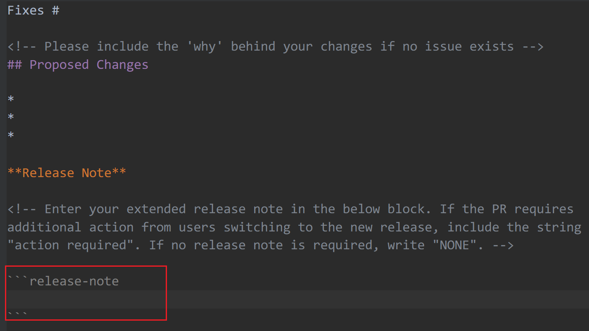

<div align="center">
    <a href="https://github.com/apps/gitautomator"></a>
    <p>
        <em>A smart automated GitHub bot for managing GitHub projects.</em>
    </p>
    <div>
        <a href="#">
            
        </a>
        <a href="https://github.com/jwcesign/gitautomator/blob/main/LICENSE">
            
        </a>
        <a href="https://github.com/jwcesign/gitautomator/stargazers">
            
        </a>
    </div>
</div>

## ❤️ Introduction

GitAutomator responds to various events in your repository, acting as a smart assistant to enhance maintenance efficiency.

## 💾 Installation

Visit the relevant [GitHub APP](https://github.com/apps/gitautomator) page to install GitAutomator. After installation, comment `/cat` on an issue or PR to check its functionality.

## ⛵  Plugins and Functions

| Name | Description |
| ---- | ----------- |
| cat | To verify if GitAutomator functions properly with your repository, use the `/cat` command in an issue or PR |
| ailabel | GitAutomator will utilize ChatGPT to label an issue or PR based on the labels in your repository and the issue/PR content |
| aireleasenote | GitAutomator checks the release note block<sup>[1]</sup>, assesses its appropriateness, and provides notifications |
| approve | GitAutomator will approve and merge a PR when the maintainer comments `/approve` |
| cherrypick | GitAutomator will cherry-pick the commits of the PR to another `<target_branch>` when the maintainer comments `/cherry-pick <target_branch>` |
| label | GitAutomator will add `<target_label>` to the PR or issue when an account comments `/label <target_label>` |
| prcomment | GitAutomator will post a thank you comment when a new PR is submitted |
| prlabel | GitAutomator will label a PR based on its title; it will label a title prefixed with `fix` as `bug`, `doc` as `documentation`, and `feat` as `enhancement` |
| prreact | GitAutomator will react with a heart when a new PR is submitted |
| prreviewrequest | GitAutomator will automatically request reviews from the maintainers configured in `.github/gitautomator.yaml` |

* **[1]**: The PR body should contain the following block:

  

  This could work excellently if you're looking to automatically generate polished release notes. Feel free to use this [template](./.github/pull-request-template.md) for your PR.

## 📃 Configuration

You can define the specific behavior by configuring the `.github/gitautomator.yaml` file in your repository. The complete configuration is as follows:
```yaml
owners:
- jwcesign # This identifies the maintainer of this repository. GitAutomator will request reviews from them for any new PR.
plugins:
- cat # This identifies the plugins to enable. If left blank, all plugins will be enabled.
```

## 🚀 Self Hosting Guide

Use the official GitHub App to manage your code repository. You can also deploy this App on a self-hosted server. Here are the detailed instructions.

### Create GitHub App

First, you need to create a GitHub app. GitHub itself [documents this](https://docs.github.com/en/apps/creating-github-apps/registering-a-github-app/registering-a-github-app). Below is the set of permissions needed.

Repository permissions:

* Commit statuses: Read and write
* Contents: Read and write
* Merge queues: Read and write
* Metadata: Read-only
* Pull requests: Read and write
* Issues: Read and write

In Subscribe to events select following events:
* Commit comment
* Issue comment
* Issues
* Label
* Merge group
* Merge queue entry
* Pull request

### Obtain App ID and Private Key

After creating a GitHub App, download the private key as `app.pem` in the current directory and remember the App ID.

### Create a Webhook Channel

Visit [https://smee.io](https://smee.io) to create a new channel, and remember the webhook proxy URL.

### Configure GitHub App Webhook URL

Navigate to the GitHub App settings page, and fill the App's webhook URL field with the Smee webhook proxy URL.

### Launch the Service

1. Clone repository:
```sh
git clone https://github.com/jwcesign/gitautomator.git
```

2. Export the necessary environment variables:
```sh
export APP_ID=xxx
export SMEEIO_URL=xxx
export CHATGPT_URL=https://api.openai.com/v1 # you can set another URL
export OPENAI_KEY=xxx # your OpenAI secret key
```

3. Run the container service:
```
docker-compose up -d
```

4. Enjoy your time!

## 🤝 Contribution

If you are interested in participating in joint development, welcome to STAR/FORK/PR.